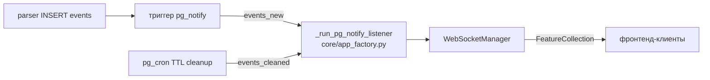

# Core microservice — логика и архитектура

Сервис `core` (контейнер из `Dockerfile.core`) — backend на `aiohttp`. Отдаёт
REST API и WebSocket фронтенду, валидирует Telegram-сессии (JWT), и мостит
события из PostgreSQL в реальном времени: `LISTEN/NOTIFY` → broadcast по
WebSocket. Наружу не публикуется — всё проксирует сервис `web` (nginx).

Код — каталог `core/`. Точка входа — `main.py` → `core/app_factory.py`.

## Технологический стек

| Компонент | Назначение |
|-----------|-----------|
| `aiohttp` | HTTP-сервер, REST, WebSocket |
| `asyncpg` | PostgreSQL-пул + `LISTEN/NOTIFY` |
| `aiogram` | Telegram-бот (Mini App entry), `pydantic`-модели |
| `pyjwt` (HS256) | access/refresh-токены сессии |
| `redis.asyncio` | session/nonce store (с in-memory fallback) |
| `prometheus-client` | метрики `/metrics` |
| `pybreaker` | circuit breaker вокруг Telegram-валидации |

## Архитектура модулей

```
core/
├── app_factory.py          # сборка aiohttp app, middleware-цепочка,
│                           #   pg_notify→WebSocket listener, startup/shutdown
├── settings.py             # @dataclass-конфиг (env только для секретов)
├── models.py               # pydantic-модели запросов/ответов
├── api/
│   ├── routes.py           # регистрация всех маршрутов
│   ├── health.py           # /health, /health/ready, /health/detailed
│   ├── auth.py             # /api/validate-init, /api/auth/refresh
│   ├── config.py           # /api/config, /api/validation-config
│   ├── events.py           # /api/events (snapshot + инкременты), /status
│   ├── websocket.py        # /ws — WebSocketManager (register/broadcast)
│   └── media.py            # отдача медиа событий
├── middlewares/
│   ├── logging_config.py   # structured logging
│   ├── metrics.py          # prometheus metrics middleware + /metrics
│   ├── csrf.py             # CSRF-защита мутаций
│   ├── jwt_auth.py         # проверка access-токена на защищённых маршрутах
│   ├── auth.py             # JWT issue/verify + RedisManager (session/nonce)
│   ├── ratelimit.py        # fixed-window rate limiter (per ip+path)
│   └── dbmiddleware.py     # инъекция db-адаптера в request
├── db/
│   ├── db_base.py          # asyncpg-пул
│   ├── dbconnect.py        # подключение/жизненный цикл
│   ├── db_events.py        # CRUD событий, снапшоты
│   ├── db_streets.py       # газеттир улиц
│   └── db_spatial.py       # PostGIS-запросы
└── utils/
    ├── cache.py            # in-memory TTL+LRU кэш событий (не Redis)
    ├── telegram_validation.py  # HMAC-SHA256 валидация initData
    └── metrics.py          # prometheus-метрики
```

## Middleware-цепочка

Порядок (`core/app_factory.py`), запрос проходит сверху вниз:

1. `logging_middleware` — структурный лог запроса
2. `metrics_middleware` — prometheus-счётчики latency/статусов
3. `csrf_middleware` — CSRF-проверка мутирующих запросов
4. `jwt_auth_middleware` — валидация access-токена (защищённые маршруты)
5. `rate_limiter.middleware` — fixed-window лимит (60/мин по умолчанию,
   per-endpoint override для `/api/events`, `/api/streets`; health исключён)

## Маршруты

| Метод | Путь | Назначение |
|-------|------|-----------|
| GET | `/health`, `/health/live` | liveness |
| GET | `/health/ready` | readiness (актуальный probe БД/redis/bot) |
| GET | `/health/detailed` | метрики пула/кэша |
| GET/POST | `/api/validation-config` | конфиг валидации для фронта |
| POST | `/api/validate-init` | HMAC-проверка Telegram initData → JWT |
| POST | `/api/auth/refresh` | обновление access-токена |
| POST | `/api/config` | подтверждение сессии |
| GET | `/api/events` | snapshot событий |
| POST | `/api/events` | инкрементальные обновления |
| GET | `/api/events/status`, `/api/data_status` | статус данных |
| GET | `/api/streets` | газеттир |
| GET | `/ws` | WebSocket (live-события) |
| GET | `/metrics` | prometheus |

## Поток live-событий (LISTEN/NOTIFY → WebSocket)



- Выделенное соединение `asyncpg` слушает каналы `events_new` и `events_cleaned`
  (`conn.add_listener`, `core/app_factory.py`).
- На NOTIFY создаётся broadcast-задача (хранится в set, чтобы не потеряться GC),
  `WebSocketManager._broadcast_payload` рассылает всем клиентам; мёртвые
  соединения снимаются с регистрации в процессе рассылки и в `finally`.
- Доставка best-effort: при реконнекте листенера событие может потеряться, но
  оно persist в БД, а фронт при (ре)коннекте делает полный fetch и догоняет.

## Аутентификация

- **Telegram initData** — HMAC-SHA256 по спецификации Telegram
  (`core/utils/telegram_validation.py`): `secret = HMAC("WebAppData", bot_token)`,
  затем сверка `hash` через `hmac.compare_digest` (constant-time). Проверка
  свежести `auth_date` (24 ч). Обёрнуто в circuit breaker (`pybreaker`).
- **JWT** — HS256, access TTL 15 мин / refresh 24 ч (`core/settings.py JWTConfig`).
  Секрет автогенерируется эфемерно в памяти при старте (`_resolve_jwt_secret`),
  если `JWT_SECRET` не задан в env; рестарт → новый секрет → ранее выданные токены
  инвалидируются. `JWT_SECRET` в env — опциональный override для стабильного/общего
  (multi-replica) секрета (≥32 символов).
- **Redis** (`RedisManager`, `core/middlewares/auth.py`) — session/nonce store;
  при недоступности — in-memory fallback (деградация, не отказ). Это **не** тот
  же кэш, что `core/utils/cache.py` (in-memory TTL+LRU кэш событий).

## Конфигурация

`core/settings.py` — всё, кроме секретов, захардкожено в `@dataclass`. Из env
читаются только: `BOT_TOKEN`, `WEBAPP_URL`, `REDIRECT_URL`,
`TELEGRAM_VALIDATION_ENABLED` (`JWT_SECRET` — опциональный override автогенерации).
Параметры пула Бога/redis/матчера
правятся прямо в `settings.py`.

## Health / observability

- `/health/ready` — без кэша (LB не пошлёт трафик на падающую БД), проверяет
  PostgreSQL (обязателен), Redis (degraded при отказе), bot.
- `/health` (liveness) — TTL-кэш probe БД 5 с.
- `/metrics` — prometheus (`set_application_info(version='2.0.0')`).
