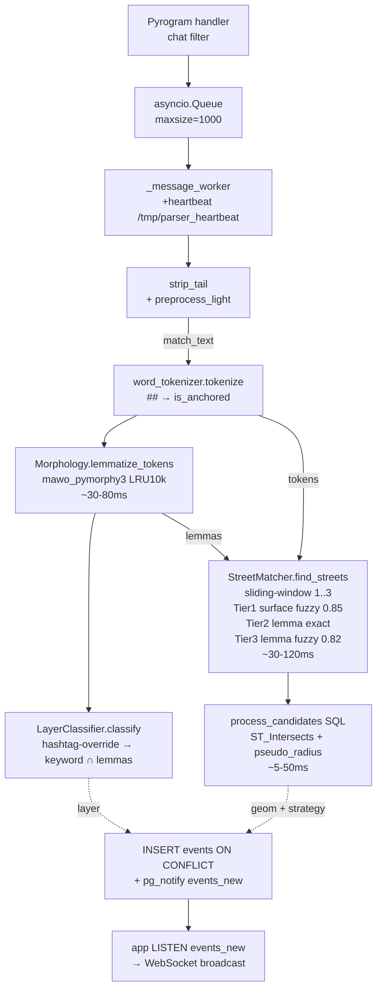

# Parser microservice — логика и алгоритм

Парсер мониторит Telegram-канал, извлекает упоминания улиц из сообщений и
сохраняет геолокированные события в PostgreSQL. Sliding-window NLP-пайплайн
на CPU (без GPU и без NER), русский язык, ~200–400 ms на сообщение.

## Технологический стек

| Компонент | Назначение |
|-----------|-----------|
| `kurigram` (pyrogram fork) | Telegram MTProto client |
| `mawo-pymorphy3` 1.0.4 | Морфологический анализатор (DAWG, ~15-20 MB RAM) |
| `rapidfuzz` 3.0+ | Surface fuzzy + lemma fuzzy матч против alias-индекса |
| `asyncpg` 0.29+ | PostgreSQL async driver |

## Архитектура модулей

```
parser/
├── monitoring.py          # Pyrogram client + asyncio.Queue + worker
├── message_processor.py   # Оркестратор pipeline
├── text_preprocessor.py   # strip_tail + preprocess_light (мягкая очистка)
├── word_tokenizer.py      # regex-разбивка по не-буквенным символам; ## → is_anchored=True
├── morphology.py          # mawo_pymorphy3 + Lemma dataclass + LRU-кэш
├── layer_classifier.py    # cops/bus/traffic/pig по keyword-матчу (hashtag-override)
├── phonetic_index.py      # Сборщик surface + lemma индексов при старте
├── street_matcher.py      # Sliding-window линкер: 3 тира (surface/lemma)
└── db_adapter.py          # PostgreSQL pool
```

## Pipeline (по шагам)

```
1. monitoring.py: Telegram handler → asyncio.Queue maxsize=1000
2. _message_worker → MessageProcessor.process_message
3. _extract_text — plain str из pyrogram, защита от UTF-16 surrogates
4. strip_tail(text) — убрать «подписаться/сообщить» хвост
5. preprocess_light(text) — HTML/время/укр-буквы+суффиксы; регистр сохранён = preserved
6. _sanitize_text — выбросить одиночные суррогаты
7. strip_emoji → match_text (только для матчинга)
8. word_tokenizer.tokenize(match_text) → tokens
9. Morphology.lemmatize_tokens(tokens) → lemmas (pymorphy3, LRU 10k)
10. LayerClassifier.classify(lemmas, tokens) → 'cops'|'bus'|'traffic'|'pig'
    └─ ## -якорные токены проверяются первыми (hashtag-override)
11. [пусто / >380 симв.] → strategy=random, выход
12. StreetMatcher.find_streets(tokens, lemmas):
    _strip_noise (пунктуация)
    _candidates_sliding_window: 1..max_sliding_window(=3) токенов
    для каждого кандидата _link_span:
      Tier 1 [Surface fuzzy] rapidfuzz(surface vs alias-names, порог 0.85)
      Tier 2 [Lemma exact]   O(1) dict lookup по lemma-tuple
      Tier 3 [Lemma fuzzy]   rapidfuzz(lemma_text vs lemma-phrases, порог 0.82)
    dedup по street_id: max score; is_anchored → +0.05 bonus
    top-K = max_entities(=5)
13. process_candidates SQL (PostGIS): пересечения → geom + strategy
14. INSERT events ON CONFLICT (message_id) + pg_notify('events_new', feature_json)
```

## Блок-схема (Mermaid)



## Тиры матчинга в `_link_span`

| Тир | Метод | Порог | Source |
|-----|-------|-------|--------|
| 1 | `fuzz.token_sort_ratio(surface, alias_names)` | 0.85 | `surface_fuzzy` |
| 2 | exact `lemma_tuple` dict lookup | — | `lemma_exact` |
| 3 | `fuzz.token_sort_ratio(lemma_text, lemma_phrases)` | 0.82 | `lemma_fuzzy` |

Тир 1 ловит опечатки (чепаевская→чапаевская ≈ 90%). Тир 2 ловит падежи без
расходов на fuzzy. Тир 3 — fallback при POS-расхождениях лемматизатора.

## Strategy от `process_candidates`

| Strategy | Когда | Геометрия |
|----------|-------|-----------|
| `random` | matches пустой или текст >380 симв. | случайная точка в overlay-зоне |
| `single_match` | 1 улица, или 2+ без пересечения | full geom лучшей улицы |
| `single_intersection` | 2+ улиц, 1 точка пересечения (или псевдо) | POINT |
| `polygon_intersection` | 2+ улиц, 2+ точек пересечения | LINESTRING/POLYGON |

## Параметры калибровки (`core/settings.py` → `SimilarityConfig`)

| Поле | Default | Назначение |
|------|---------|-----------|
| `entity_similarity_threshold` | 0.82 | Порог tier-3 lemma fuzzy (0-1) |
| `phonetic_match_threshold` | 0.85 | Порог tier-1 surface fuzzy (0-1) |
| `max_entities` | 5 | Финальный top-K результатов |
| `max_sliding_window` | 3 | Максимальный размер окна (токенов) |
| `prepositional_boost` | 0.05 | Бонус score при предлоге перед кандидатом |
| `pseudo_intersection_radius_meters` | 150.0 | Радиус псевдо-пересечений в SQL |
| `max_text_length` | 380 | Длиннее → strategy=random |
| `lemma_fallback_enabled` | True | Включение tier-3 lemma fuzzy |

| Поле | Default | Назначение |
|------|---------|-----------|
| `history_limit` | 100 | Сообщений из истории при старте |
| `message_queue_maxsize` | 1000 | Размер asyncio.Queue |

## Метрики качества (события_экспорт, ~99 событий)

| Метрика | Значение |
|---------|---------|
| `random` % | ~28 (нет распознанной улицы) |
| `single_match` % | ~58 |
| `single_intersection` % | ~9 |
| `polygon_intersection` % | ~5 |
| FP stopwords заблокировано | мусорской, семья, книжный |

## Известные ограничения

1. **Отсутствующие улицы**: Ватутина, Бабеля, Старопортофранковская, Чепаевская
   и др. не в `streets.csv` → стратегия `random`.
2. **Упрощённые геометрии**: ~132 улицы хранятся как прямой отрезок из 2 точек;
   `ST_Intersects` находит пересечение не для всех реально перекрёстных пар.
3. **Sliding-window лимит 3**: улицы из 4+ слов не покрываются одним окном.
4. **Один последовательный воркер**: при росте потока канала throughput упирается
   в одно ядро. Решение: `ProcessPoolExecutor` для `find_streets`.
5. **Layer-keywords**: точное равенство лемм. Производные формы расширяются
   через явное перечисление в `DEFAULT_LAYER_KEYWORDS`.
