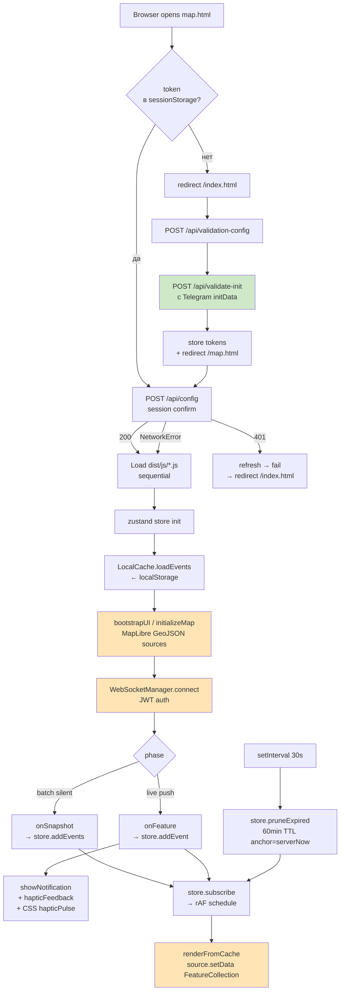

# Web microservice — логика и алгоритм

Сервис `web` (контейнер из `Dockerfile.web`) = nginx, который раздаёт
скомпилированный фронтенд и проксирует API/WebSocket на сервис `core`.
Фронтенд — vanilla TypeScript PWA Telegram Mini App: карта `MapLibre GL JS`
(native), state — единый `zustand` store, события из WebSocket агрегируются
client-side.

См. также `web/CLAUDE.md` — 8 архитектурных правил-инвариантов, и `nginx.conf`
— reverse-proxy/CSP/кэш-политики.

## Технологический стек

| Компонент | Назначение |
|-----------|-----------|
| `maplibre-gl` 4.x | Native vector map (OpenFreeMap positron tiles) |
| `zustand` 5.x | Reactive store с persistence subscription |
| `@nazka/map-gl-js-spiderfy` 2.x | Cluster expansion при клике |
| webpack 5 | Bundle js/* → dist/js/* (production mode) |
| `@telegram-apps/sdk-react` indirect | Через `window.Telegram.WebApp` global |
| nginx:alpine | Static serving |

## Архитектура модулей

```
web/
├── index.html              # Gate page: /api/validate-init → JWT
├── map.html                # Map page: gate-check → loadScript dist/js/*
├── sw.js                   # Service worker — precaches app shell
├── manifest.webmanifest    # PWA manifest
├── js/
│   ├── common.js           # window.serverNow, hapticFeedback, showNotification
│   ├── core/
│   │   ├── store.ts        # Zustand store (eventsById, filters, TTL)
│   │   ├── local_cache.ts  # localStorage persistence adapter
│   │   ├── websocket.ts    # /ws connection + reconnect + heartbeat
│   │   ├── event_manager.ts# store.subscribe → rAF scheduler
│   │   ├── map.ts          # popup creators
│   │   ├── ui.ts           # bootstrapUI, initializeMap, renderFromCache
│   │   └── token-manager.js# JWT refresh loop
│   ├── modules/
│   │   ├── popups.js       # Legend popup, click handlers
│   │   └── notifications.js# New-event notification rendering
│   └── telegram/
│       └── integration.js  # tg.WebApp wrapper, theme, haptic
├── css/styles.css
└── dist/                   # webpack output (gitignored)
```

## 8 архитектурных правил (web/CLAUDE.md)

1. **PWA microservice** — works online and offline (sw.js precaches shell)
2. **Validation gate** — no components before backend confirms session
3. **Incremental local cache** — store = single source of truth,
   `local_cache.ts` только адаптер localStorage
4. **Full load on connect, then live stream** — batch silent,
   live events trigger notification (boundary = `events_snapshot_end`)
5. **Haptic feedback on every notification** — через `window.hapticFeedback()`
   (теперь с CSS `hapticPulse` fallback)
6. **Event TTL 60 минут** — anchored к `serverNow()` (не device clock)
7. **Optimised for Telegram WebView** — `source.setData()` per-update,
   no layer recreation, rAF-driven render
8. **Lightweight final image** — multi-stage build, node только в builder

## Pipeline загрузки (Mermaid)



## TTL и серверное время

```js
// common.js:13
window.serverNow = () => Date.now() + (window.serverClockOffsetMs || 0);

// WebSocket update offset from every message timestamp:
serverClockOffsetMs = serverMs - Date.now();

// store.ts: pruneExpired
const age = serverNow() - feature.properties.time;
if (age > 60*60*1000 || age < -5*60*1000) drop;
```

Это защита от device clock skew / неверного timezone — TTL анкорится на
сервер, не на локальные часы устройства.

## Haptic feedback fallback chain

Telegram WebApp HapticFeedback API:
- v6.1+ → `tg.HapticFeedback.impactOccurred(...)` работает
- v6.0 → API существует, но методы кидают "not supported"
- v5.x и ниже → API отсутствует

Текущая цепочка (`web/js/common.js:hapticFeedback`):

```
1. Если tg.HapticFeedback существует И version >= 6.1:
   → tg.HapticFeedback.impactOccurred(type) | notificationOccurred | selectionChanged
2. Иначе → telegramIntegration.hapticFeedback() (та же проверка через
   tg.isVersionAtLeast('6.1'))
3. Иначе → navigator.vibrate(N) (HTML5 Vibration API, mobile only)
4. Иначе → silent no-op
```

**Visual fallback** (всегда срабатывает):

```css
/* keyframes hapticPulse */
@keyframes hapticPulse {
    0% { transform: scale(1) translateX(0); }
    15% { transform: scale(1.02) translateX(-2px); }
    30% { transform: scale(1.02) translateX(2px); }
    /* ... */
}
```

`showNotification()` применяет `animation: slideDown 0.3s, hapticPulse 0.4s`
к каждому уведомлению — даёт визуальную «вибрацию» независимо от platform.

## Диагностика «haptic не работает»

### Шаг 1: подтвердить что новый dist в контейнере web

```bash
sudo docker exec web grep -c "navigator.vibrate" /usr/share/nginx/html/dist/js/common.js
# Ожидаем >0. Если 0 — нужно rebuild сервиса web:
sudo docker compose build web && sudo docker compose up -d web
```

### Шаг 2: инвалидация service worker cache

```js
// В DevTools console внутри Telegram WebView:
navigator.serviceWorker.getRegistrations()
    .then(rs => rs.forEach(r => r.unregister()));
// Затем hard reload (Ctrl+Shift+R) или открыть WebApp заново
```

`sw.js` штампуется `__BUILD_ID__` при сборке, новые сборки → новый SW.

### Шаг 3: проверить console logs

В localhost dev mode `hapticFeedback` логирует один раз:
```js
[hapticFeedback] env: {
    webappVersion: "6.0",
    versionNumber: 6,
    platform: "unknown",
    hasNativeHaptics: true,
    nativeSupported: false,   // ← native пропущен для v6.0
    hasNavigatorVibrate: true // ← на mobile должно быть true
}
```

### Шаг 4: проверить platform

- **Telegram Mobile (iOS/Android)** → `navigator.vibrate` работает,
  тактильная вибрация ощущается
- **Telegram Desktop** (Qt WebEngine) → `navigator.vibrate` обычно
  не поддерживается. By-design: на desktop нет hardware vibration
- **Регулярный браузер** → зависит от browser (Chrome mobile — да,
  Chrome desktop — нет)

CSS `hapticPulse` срабатывает на всех — это visual fallback.

## Известные ограничения

1. **Telegram WebApp v6.0**: HapticFeedback API ломаный, fallback через
   navigator.vibrate. На desktop никакой тактильной обратной связи —
   только visual `hapticPulse`
2. **Service worker cache**: после rebuild клиент должен переоткрыть
   WebApp / unregister SW. `__BUILD_ID__` помогает, но не всегда mobile
   подтягивает новый SW моментально
3. **MapLibre on slow Telegram WebView**: heavy при медленной сети.
   Используется `source.setData(full FeatureCollection)` per-update —
   нет per-object diffing. Это компромисс простоты vs cherrypick.
4. **localStorage limits**: ~5 MB per-origin в большинстве WebView.
   При 60-min TTL и средних события рост контролируется
